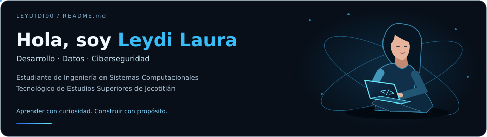
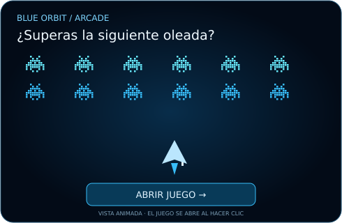
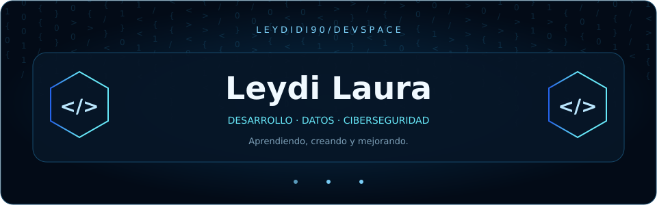
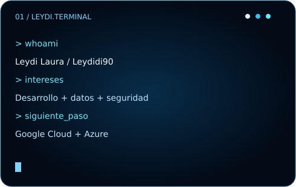
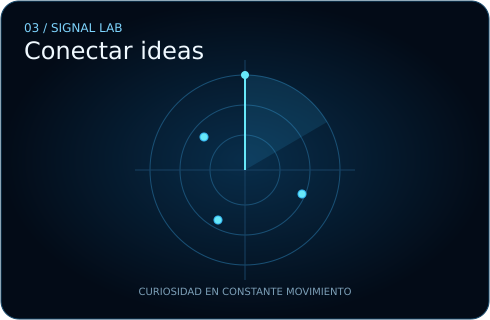
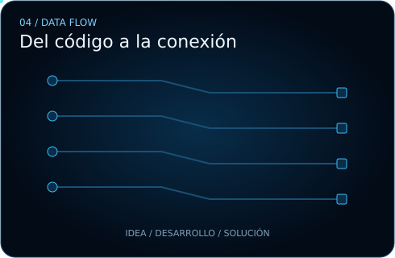

  
  
  
  
  

Me gusta crear soluciones útiles, automatizar procesos y conectar el desarrollo con la seguridad de la información.

  
  

<table>
<tr>
<td width="61%" valign="top">
  <h3>◈ Actividad y contribuciones</h3>
  <picture>
    <source media="(prefers-color-scheme: dark)" srcset="https://raw.githubusercontent.com/Leydidi90/Leydidi90/output/pacman-contribution-graph-dark.svg">
    <source media="(prefers-color-scheme: light)" srcset="https://raw.githubusercontent.com/Leydidi90/Leydidi90/output/pacman-contribution-graph.svg">
    
  </picture>
  
</td>
<td width="39%" valign="top" rowspan="2">
  <h3>⌘ Proyectos y código</h3>
  
  
<b>Blue Orbit</b> Un juego de naves con disparos, oleadas, controles táctiles y récord local.

  
HTML · CSS · JavaScript <a href="https://leydidi90.github.io/Leydidi90/arcade.html">Jugar →</a> · <a href="./arcade.html">Ver código →</a>

  

  <b>Más proyectos</b>
  
Explora los repositorios que comparto y sigue mi aprendizaje.

  <a href="https://github.com/Leydidi90?tab=repositories">Ver mis repositorios →</a>
</td>
</tr>
<tr>
<td width="61%" valign="top">
  <h3>✦ Tech stack</h3>
  
  
React · Tailwind · Node.js · Express · PostgreSQL · Oracle

  

  <b>Aprendiendo ahora</b>
  

  Cloud Computing · Ciberseguridad · Arquitectura backend
</td>
</tr>
</table>

<b>“Aprender con curiosidad. Construir con propósito.”</b>

<b>＋ Sobre mí y contacto</b>

 

Estudio Ingeniería en Sistemas Computacionales en el <b>Tecnológico de Estudios Superiores de Jocotitlán</b>.

<ul>
<li><b>Desarrollo:</b> React, Tailwind, Node.js y Express.</li>
<li><b>Bases de datos:</b> Oracle y PostgreSQL.</li>
<li><b>Infraestructura:</b> fibra óptica, microenlaces y videovigilancia.</li>
<li><b>Mi enfoque:</b> automatizar procesos, mejorar la experiencia del usuario y cuidar la información.</li>
</ul>

<a href="mailto:leydibernal98@gmail.com">leydibernal98@gmail.com</a> · <a href="https://github.com/Leydidi90">GitHub</a>

<b>＋ Explora mi universo animado</b>

 

  
  

